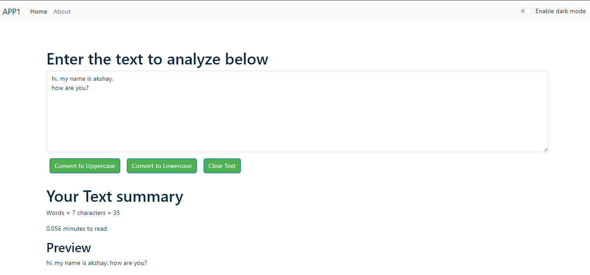
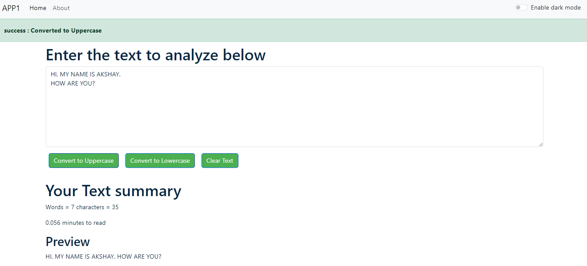
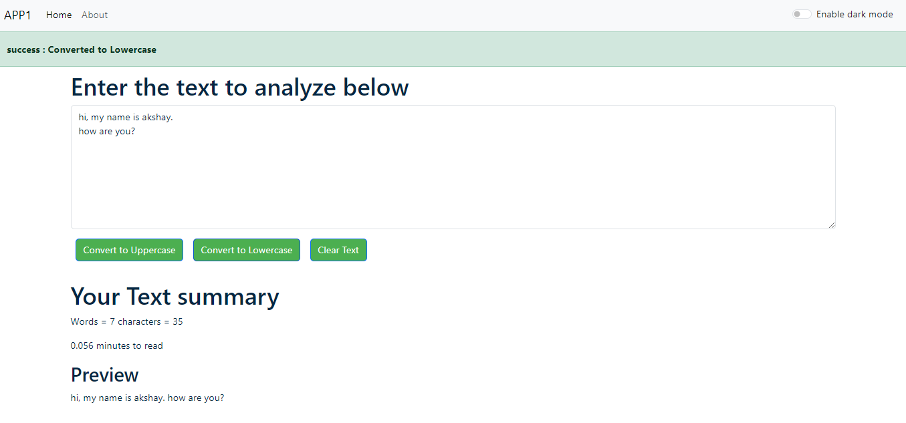
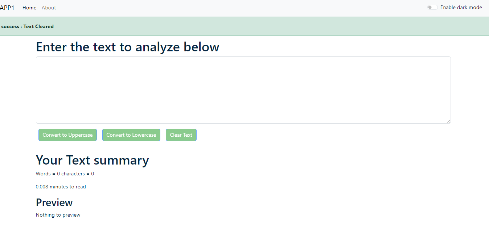
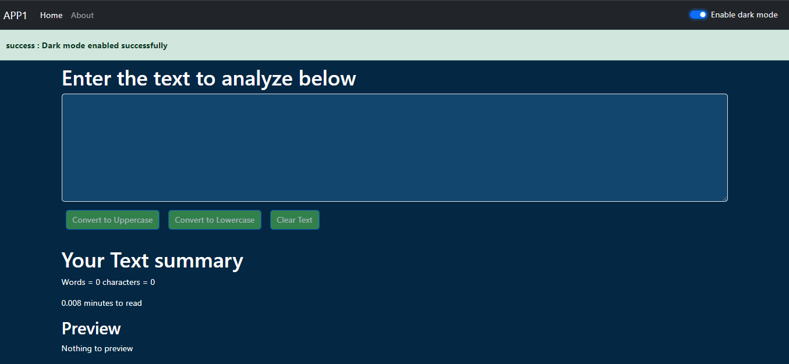
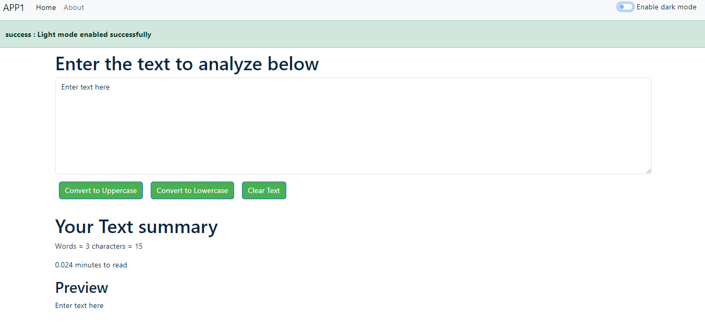

# TextUtils

TextUtils is a web-based text utility application that allows users to perform various text transformations and analyses. This project is built using React.js and showcases key features such as text transformation, word and character counting, and readability estimation.

## Features

- **Text Transformations**: Users can convert text to uppercase, lowercase, and clear the text.
- **Word and Character Count**: The app provides real-time word and character counts as users type.
- **Readability Estimation**: Estimates the time required to read the text based on the word count.
- **Responsive Design**: The application is designed to be responsive, ensuring a smooth experience on both desktop and mobile devices.

## Technologies Used

- **Frontend**: React.js
- **Styling**: Bootstrap,CSS

## Learning Outcomes

By building TextUtils, I have gained hands-on experience in:

- **React.js**: Developing dynamic and responsive web applications using React.js.
- **State Management**: Managing and updating component states in real-time.
- **Event Handling**: Handling user inputs and events to provide an interactive user experience.
- **Responsive Design**: Ensuring the application is usable across different screen sizes and devices.

